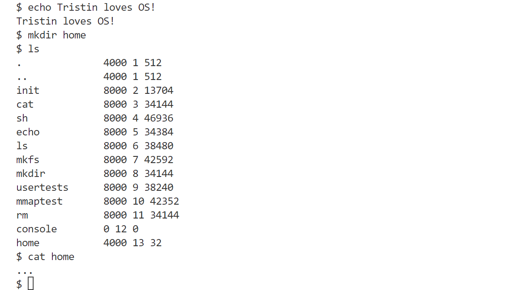
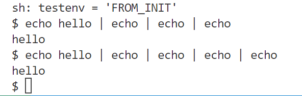

# Final

## 1. File Descriptor

### 1.1 任务

> - [x] **任务 1**：实现`src/fs/file.c`的下列函数：
>
>   ```c
>   // 从全局文件表中分配一个空闲的文件
>   struct file* file_alloc();
>   
>   // 获取文件的元信息（类型、偏移量等）
>   int file_stat(struct file* f, struct stat* st);
>   
>   // 关闭文件
>   void file_close(struct file* f);
>   
>   // 将长度为 n 的 addr 写入 f 的当前偏移处
>   isize file_read(struct file* f, char* addr, isize n);
>   
>   // 将长度为 n 的 addr 从 f 的当前偏移处读入
>   isize file_write(struct file* f, char* addr, isize n);
>   
>   // 文件的引用数+1
>   struct file* file_dup(struct file* f);
>   
>   // 初始化全局文件表
>   void init_ftable();
>   
>   // 初始化/释放进程文件表
>   void init_oftable(struct oftable*);
>   void free_oftable(struct oftable*);
>   ```
>
> - `file_alloc`
>
>   - 遍历`ftable`，找到`ref == 0`的`file`，将`ref`设为`1`，返回对应的`file`
>   - 为了方便调试，这里添加了失败检查，如果未找到合适的`file`，`PANIC()`
>
> - `file_stat`
>
>   - 直接用`stati`就好了
>
> - `file_close`
>
>   - `ref`减一
>   - `f->type == FD_PIPE`: `pipe_close`，这是后话
>   - `f->type == FD_INODE`: 需要进行`inode_put`
>
> - `file_read`
>
>   - 还是根据`f->type`分类
>   - `FD_PIPE`: `pipe_read`（这也是后话）
>   - `FD_INODE`: 调用`inode_read`
>
> - `file_write`
>
>   - 和`read`类似，不过需要注意的是，一次`write`不一定能够在一次事务完成，因为有`OP_MAX_NUM_BLOCKS`的限制，因此我使用多个事务，每个事务的写数据块数略少于`OP_MAX_NUM_BLOCKS`，因为除了数据块可能还有其他块的脏块。
>
>   - 此外要保证写的范围不能超出`INODE_MAX_BYTES`
>
> - `file_dup`
>
>   - 很简单的逻辑，`ref`加一
>
> - `init_ftable`
>
>   - 初始化锁
>
> - `init_oftable`
>
>   - `memset`一下
>
> - `free_oftable`
>
>   - 将`oftable`中非`NULL`的文件描述符指针改为`NULL`，需要调用`file_close`

---

> - [x] **任务 2**：编写路径字符串（例如 `/this/is//my/path/so_cool.txt`）的解析逻辑。助教已经在`src/fs/inode.c`中实现了比较困难的部分，需要我完成其中的`namex`函数（可见`inode.c`中的注释部分）：
>
>   ```c
>   static Inode* namex(const char* path, bool nameiparent, char* name, OpContext* ctx)
>   // 给出path对应的inode
>   // 如果nameiparent == TRUE，返回上一级
>   // name是路径里最后一个元素
>   ```
>
> - 首先回顾&预习一下以下函数：
>
>   ````c
>   usize inode_look_up(Inode* inode, const char* name, usize* index)
>   // 在目录inode下寻找文件名为'name'的inode，返回其inode_no
>   const char *skipelem(const char *path, char *name)
>   // 提取出path中的下一个元素，并拷贝到name中，然后返回在下个元素之后的后续路径
>   ````
>
> * 实现思路：
>
>   * 首先要确认从何处开始寻找
>
>     * 相对路径：不是以`'/'`开头，需要获得当前进程所在目录，这是通过给`Proc`结构体增加了`cwd`成员实现的
>
>       > [!note]
>       >
>       > - [x] 需要完善`proc.c`中有关`cwd`的修改
>       >
>       > * 初始化进程时，需要将`cwd`设置为`root_inode`
>       > * 进程退出时也要及时unshare`cwd`
>
>     * 绝对路径：从根目录开始寻找
>
>   * 其次，循环调用`skipelem`来解析路径
>
>     > [!note]
>     >
>     > 参考了xv6的实现
>
>     > [!tip]
>     >
>     > 这里有一件很重要的事情！
>     >
>     > 最终如果返回的是非`NULL`的inode，这个`inode`会被隐式地进行`get`或`dup`，之后需要及时地释放（`put`）。
>     >
>     > 与此同时，在`namex`函数中的`inode`也需要及时地`inode_put`

---

> 小插曲：这里尝试跑通之前的测试时，发现会输出
>
> ````shell
> (warn) init_inodes: no root inode.
> ````
>
> 原因是我们没有从SD卡读取超级块，回忆lab4.2，结合SD卡和磁盘布局：
>
> ```shell
> // SD card distribution
> /*
> 512B            FAT32         file system
> +-----+-----+--------------+----------------+
> | MBR | ... | boot partion | root partition |
> +-----+-----+--------------+----------------+
> \   1MB   / \    64MB    / \     63MB     /
> +-------+   +----------+   +------------+
> */
> 
> // disk layout:
> // [ MBR block | super block | log blocks | inode blocks | bitmap blocks | data blocks ]
> ```
>
> 完善`init_block_device`函数
>
> ```c
> void init_block_device()
> {
>  // read super block from SD card
>  Buf b;
>  b.flags = 0;
>  b.block_no = (u32)0x0;
>  virtio_blk_rw(&b);
>  u8 *data = b.data;
>  int LBA = *(int *)(data + 0x1CE + 0x8);
>  sd_read((usize)(LBA + 1), sblock_data);
>  // print_superblock();
>  block_device.read = sd_read;
>  block_device.write = sd_write;
> }
> ```
>
> 这里的`print_superblock`是为了打印读取后的超级块信息以验证读取是否正确，打印信息如下：
>
> ```shell
> Super Block:
> ---------------------
> num_blocks: 1000
> num_data_blocks: 908
> num_inodes: 200
> num_log_blocks: 63
> log_start: 2
> inode_start: 65
> bitmap_start: 91
> ---------------------
> ```

---

> - [x] **任务 3**：为了对接用户态程序，我们需要在 src/kernel/sysfile.c 中实现一些系统调用：
>
> - [close(3)](https://linux.die.net/man/3/close)
>
>   ```c
>   if (fd < 0 || fd >= NOFILE) {
>       return -1;
>   }
>   auto ft = &thisproc()->oftable;
>   if (ft->file[fd]) {
>       file_close(ft->file[fd]);
>       ft->file[fd] = NULL;
>   }
>   ```
>
> - [chdir(3)](https://linux.die.net/man/3/chdir)
>
>   ```c
>   OpContext ctx;
>   Proc *p = thisproc();
>   Inode *ip;
>   bcache.begin_op(&ctx);
>   if ((ip = namei(path, &ctx)) == 0) {
>       bcache.end_op(&ctx);
>       printk("FROM %s, %d, NOT FOUND!\n", __FILE__, __LINE__);
>       return -1;
>   }
>   inodes.lock(ip);
>   if (ip->entry.type != INODE_DIRECTORY) {
>       inodes.unlock(ip);
>       inodes.put(&ctx, ip);
>       bcache.end_op(&ctx);
>       printk("FROM %s, %d, NOT A DIR!\n", __FILE__, __LINE__);
>       return -1;
>   }
>   inodes.unlock(ip);
>   inodes.put(&ctx, p->cwd);
>   bcache.end_op(&ctx);
>   p->cwd = ip;
>   return 0;
>   ```
>
>   > [!note]
>   >
>   > 参考了xv6的实现

---

> - [x] **任务 4**：实现辅助函数：
>
> ```c
> // 从描述符获得文件
> static struct file *fd2file(int fd);
> // 从进程文件表中分配一个空闲的位置给 f
> int fdalloc(struct file *f);
> // 根据路径创建一个 Inode
> Inode *create(const char *path, short type, short major, short minor, OpContext *ctx) 
> ```
>
> * `fd2file`
>
>   * 很简单，就是返回当前进程`oftable`对应索引`fd`的文件
>
> * `fdalloc`
>
>   * 和`file_alloc`类似，操作对象由`ftable`改为进程的`oftable`
>
> * `create`
>
>   * 参考了xv6的实现
>
>   * 首先获取`path`的父目录`dp`以及`name`
>
>   * 查找`dp`下是否有`name`，若是，直接返回对应的`inode`
>
>   * 否则进行创建，需要添加`'.','..'`项以及`name`项
>
>     > [!note]
>     >
>     > 需要注意的是异常处理，比如父目录不存在，`type`错误，新的目录项创建错误等等。

---

> - [x] **任务 5**：参考讲解部分，修改 `inode.c` 中 `read` 和 `write` 函数，以支持设备文件。
>   * 对于设备文件直接调用`console_read`和`console_write`


> 另一个插曲：发现我的`inode.c`中的insert逻辑不太对导致效率低下，已修改

## 2. Fork & Exec

### 2.1. ELF可执行文件格式

```c
/**
 * ELF Header：ELF 文件的入口点，位于文件的开头，描述了文件的整体布局和重要属性。
 */
typedef struct {
  	// 标识 ELF 文件的魔数、架构类型（32/64 位）、字节序（小端/大端）等。
	unsigned char e_ident[EI_NIDENT];
  
  	// 文件类型（可执行文件、共享库、目标文件等）。
    Elf64_Half    e_type;
  
  	// 指定目标机器架构（如 x86、ARM）。
    Elf64_Half    e_machine;
  
  	// ELF 版本信息。
    Elf64_Word    e_version;
  
  	// 程序入口地址（可执行文件运行时的起始地址）。
    Elf64_Addr    e_entry;
  
  	// 程序头表（Program Header Table）的偏移量。
    Elf64_Off     e_phoff;
  
  	// 段头表（Section Header Table）的偏移量。
    Elf64_Off     e_shoff;
    Elf64_Word    e_flags;
    Elf64_Half    e_ehsize;
    Elf64_Half    e_phentsize;
    Elf64_Half    e_phnum;
    Elf64_Half    e_shentsize;
    Elf64_Half    e_shnum;
    Elf64_Half    e_shstrndx;
} Elf64_Ehdr;


/**
 * Program Header Table (PHT)：描述程序运行时需要加载的段信息，主要用于可执行文件和共享库。
 */
typedef struct {
  	// 段类型（如加载段、动态段、解释器段等）。
    Elf64_Word    p_type;
  
  	// 段的权限（可读、可写、可执行）。
    Elf64_Word    p_flags;
  
  	// 段在文件中的偏移量。
    Elf64_Off     p_offset;
  
  	// 段的虚拟地址（内存中的地址）。
    Elf64_Addr    p_vaddr;
  
  	//  段的物理地址（针对嵌入式设备）。
    Elf64_Addr    p_paddr;
  
  	// 段在文件中的大小。
    Elf64_Xword   p_filesz;
  
  	// 段在内存中的大小（可能大于文件中大小）。
    Elf64_Xword   p_memsz;
  
  	// 段的对齐要求。
    Elf64_Xword   p_align;
} Elf64_Phdr;
```

### 2.2. `fork()`系统调用

> - [x] **思考**：文件描述符的“复制”是什么意思？
>
>   在fork语境下，子进程需要复制父进程的`oftable`和`cwd`
>
>   这里的复制，一方面是要在子进程拷贝一份文件描述符指针，另一方面需要调用`file_dup`

> [!note]
>
> 为了配合 `fork()`，你可能需要在原先的 `UserContext` 中加入所有寄存器的值。此外，你还需要保存`tpidr0` 和 `q0`，因为musl libc会使用它们。
>
> ```assembly
> trap_entry:
>  pushp(x29, lr)
>  pushp(x27, x28)
>  pushp(x25, x26)
>  pushp(x23, x24)
>  pushp(x21, x22)
>  pushp(x19, x20)
>  pushp(x17, x18)
>  pushp(x15, x16)
>  pushp(x13, x14)
>  pushp(x11, x12)
>  pushp(x9, x10)
>  pushp(x7, x8)
>  pushp(x5, x6)
>  pushp(x3, x4)
>  pushp(x1, x2)
>  mrs x1, sp_el0
>  pushp(x1, x0)
>  mrs x1, elr_el1
>  mrs x0, spsr_el1
>  pushp(x0, x1)
>  str q0, [sp, #-0x10]!
>  mrs x1, tpidr_el0
>  pushp(x0, x1)
>  mov x0, sp
>  bl trap_global_handler
> 
> trap_return:
>  popp(x0, x1)
>  msr tpidr_el0, x1
>  ldr q0, [sp], #0x10 
>  popp(x0, x1)
>  msr spsr_el1, x0
>  msr elr_el1, x1
>  popp(x1, x0)
>  msr sp_el0, x1
>  popp(x1, x2)
>  popp(x3, x4)
>  popp(x5, x6)
>  popp(x7, x8)
>  popp(x9, x10)
>  popp(x11, x12)
>  popp(x13, x14)
>  popp(x15, x16)
>  popp(x17, x18)
>  popp(x19, x20)
>  popp(x21, x22)
>  popp(x23, x24)
>  popp(x25, x26)
>  popp(x27, x28)
>  popp(x29, lr)
>  eret
> ```

* 首先创建一个新的进程，并与当前进程建立父子关系

* 将子进程的`gregs[0]`设置为0，这将是子进程的返回值

* 将父进程的sections和页表拷贝给子进程

  > [!note]
  >
  > * 子进程的`file`以及`offset`应和父进程保持一致（需要调用`file_dup`）
  > * 所谓页表拷贝，即对于sections里面的地址范围，子进程对应的页表项需要和父进程一致。为了使子进程与父进程共享页，需要将这些页冻结（即**只读**）。之后如果需要写，则会触发**pagefault**，需要写的进程释放共享页，创建新页，拷贝原有的页，新页可读写。

* 子进程的`cwd`以及`oftable`也需要和亲进程一致

* 最后启动子进程（`start_proc`），入口是`trap_return`

### 2.3. `execve()`系统调用

```c
/**
 * @path: 可执行文件的地址。
 * @argv: 运行文件的参数（即 main 函数中的 argv ）。
 * @envp: 环境变量
 */
int execve(const char* path, char* const argv[], char* const envp[]) 
```

* `execve()` 替换当前进程为 `path` 所指的 ELF 格式文件，加载该 ELF 文件，并运行该程序。你需要读取 `Elf64_Ehdr` 和 `Elf64_Phdr` 结构，注意根据 `p_flags` 的信息判断 section 类型，把 `p_vaddr`, `p_memsz`, `p_offset` 等信息填入到实验框架中的 `struct section` 对应位置；将文件中的代码和数据加载到内存中，并**设置好用户栈、堆等空间**；最后跳转到 ELF 文件的入口地址开始执行

> - [x] **思考** 
>
> 1. 替换 ELF 文件时，当前进程的哪些部分需要释放，哪些部分不需要？
>    * 页表(包括sections)需要释放
>    * `oftable`不需要释放
> 2. 是否需要把 `argv` 和 `envp` 中的实际文本信息复制到新进程的地址空间中？
>    * 需要。我选择放到用户栈内

大致流程：

1. 尝试从`path`加载文件

   ```c
   if ((ip = namei(path, &ctx)) == 0) {
       bcache.end_op(&ctx);
       Error；
       printk("Path %s not found!\n", path);
       return -1;
   }
   ```

   * 添加了路径检查

2. 读取`ELF_header`

   * 首先需要检查格式：

     * `ELF_header`长度合法性

       ```c
       if (inodes.read(ip, (u8 *)(&elf), 0, sizeof(Elf64_Ehdr)) !=
           sizeof(Elf64_Ehdr)) {
           Error;
           printk("Elf header maybe corrupted\n");
           goto bad;
       };
       ```

       > [!note]
       >
       > `Error`仅仅是一个宏定义，输出`(Error)`
       >
       > 这里的`bad`参照了xv6的设计，意为处理`execve`中的非法情况
       >
       > ```c
       > bad:
       >  if (pgdir) {
       >      free_pgdir(pgdir);
       >  }
       >  if (ip) {
       >      inodes.unlockput(&ctx, ip);
       >      bcache.end_op(&ctx);
       >  }
       > ```

     * `magic number` & `architecture`

       ```c
       if (strncmp((const char *)e_ident, ELFMAG, SELFMAG) != 0 ||
           e_ident[EI_CLASS] != ELFCLASS64) {
           Error;
           printk("File format not supported.\n");
           goto bad;
       }
       ```

   * 获取`e_phoff,e_phnum`

   * 遍历program headers

     * 要检查读取是否完整

     * 只解析类型为`PT_LOAD`

     * 这里要注意每个section的地址，因为堆将被分配在高于text，data，bss段的地址空间

     * `p_flags`为`PF_R | PF_X`代表text段，采用lazy allocation

       ```c
       sec->end = sec->begin + phdr.p_filesz;
       
       // lazy allocation
       sec->fp = file_alloc();
       sec->fp->ip = inodes.share(ip);
       sec->fp->readable = TRUE;
       sec->fp->writable = FALSE;
       sec->fp->ref = 1;
       sec->fp->off = 0;
       sec->fp->type = FD_INODE;
       sec->length = phdr.p_filesz;
       sec->offset = phdr.p_offset;
       ```

     * `PF_R | PF_W`代表data&bss段。data段不采用lazy allocation，直接从文件读取

     * bss段直接将全零页映射到页表中，需要注意的是对应页的flags为`PTE_USER_DATA | PTE_RO`

     * data&bss段的长度是memsz而非filesz

   * 初始化堆，主要就是设置一个合理的`begin`，此时`end = begin`

     > [!note]
     >
     > 所谓合理，就是不会与其他段产生地址冲突；同时为了契合我的`sbrk`实现，我选择使`begin`对齐到页。最终的实现是在

   * 初始化用户栈，用户栈结构可能如下：

     ```shel
     *   +-------------+
     *   | envp[m][sm] |
     *   +-------------+
     *   |    ....     |
     *   +-------------+
     *   | envp[m][0]  |
     *   +-------------+
     *   |    ....     |
     *   +-------------+
     *   | envp[0][s0] |
     *   +-------------+
     *   |    ....     |
     *   +-------------+
     *   | envp[0][0]  | 
     *   +-------------+
     *   | argv[n][sn] |
     *   +-------------+
     *   |    ....     |
     *   +-------------+
     *   | argv[n][0]  |
     *   +-------------+
     *   |    ....     |
     *   +-------------+
     *   | argv[0][s0] |
     *   +-------------+
     *   |    ....     |
     *   +-------------+
     *   | argv[0][0]  |  
     *   +-------------+  <== str_start
     *   | envp_ptr[m] |  = 0
     *   +-------------+
     *   |    ....     |
     *   +-------------+  
     *   | envp_ptr[0] |
     *   +-------------+  <== envp_start
     *   | argv_ptr[n] |  = 0
     *   +-------------+
     *   |    ....     |
     *   +-------------+  
     *   | argv_ptr[0] |
     *   +-------------+  <== argv_start
     *   |    argc     |
     *   +-------------+  <== sp
     ```

     > [!note]
     >
     > * ptr指的是对应参数的地址，参数字符串的保存位置合法即可，但argc以及参数指针在栈中的排列顺序是严格要求的
     > * 栈是由高地址向低地址增长，这里设置栈顶为`0x8000000`，栈最大为16页
     > * 在跑代码的时候发现栈顶以上的空间会被访问到，这里为其预留了一页的大小

   * 将所有的段加入`pgdir.section_head`

   * 需要设置`thisproc().ucontext`中的`sp`为上图中的`&argc`，`elr`为`elf.e_entry`

### 2.4. lab7的内容

> `mem.c`
>
> * `zero_page`：将之前所有可分配页的第一个固定为全零页，不能再分配
>
> * `struct page pages[ALL_PAGE_COUNT]`：用于记录每一页的`ref cnt`
> * [x] `kalloc_page()`：增加`increment_rc(&pages[PAGE_INDEX(ret)].ref);`（也就是初始化为1，添加了检查初始值是否为0）
> * [x] `kfree_page()`：首先`decrement_rc(&pages[idx].ref)`，如果`ref == 0`，才真正释放这一页
> * [x] `left_page_cnt()`：很简单，就是返回`ALLOCATABLE_PAGE_COUNT - kalloc_page_cnt.count`
> * [x] `get_zero_page()`：就是返回`zero_page`

> `paging.c`
>
> - [x] `init_sections`：不需要单独初始化`heap`，简单地初始化一下`Listnode`即可
>
> - [x] `free_sections`：遍历`section`，释放它们占用的页表
>
>   > - [ ] `free_sections`需要在`mmap`部分修改
>
> - [x] `sbrk`：获取当前进程的页表，找到`heap`段
>
>   - 如果是增加，由于**lazy allocation**，暂时不需要分配页表
>   - 如果是减少，需要释放空出的页表
>
> - [x] `pagefault_handler`：首先在当前进程页表找到对应地址所在的`section`，根据`flags`:
>
>   * `ST_HEAP`：为对应的地址分配页，调用`vmmap`将分配的页的地址填入页表
>   * `ST_DATA`：data和bss段触发缺页的机制是相同的：
>     * data段并没有lazy allocation，但是存在写共享页的情况，所以需要释放原先的页并拷贝给新创建的页
>     * bss段是写全零页，和data类似
>
>   * `ST_TEXT`：需要根据`sec`的`length`，`offset`，调用`file_read`读取text段
>
>   * `ST_USER_STACK`：有两种情况
>     * 一是lazy allocation导致的，这种情况和heap类似
>     * 二是由于共享栈被冻结，写入产生缺页异常，这种情况和data段类似
>
> - [x] `copy_sections`：就是简单的遍历`from_head`，将他的每个节点都拷贝给`to_head`

> `pt.c`
>
> - [x] `init_pgdir`：增加初始化`lock`和`section_head`
>
> - [x] `vmmap`：在页表`pd`中将虚拟地址`va`映射到内核地址`ka`对应的物理地址，同时加上`flags`
>
>   > [!note]
>   >
>   > 修改页表后需要调用`arch_tlbi_vmalle1is()`以清空TLB 。
>
> - [x] `copyout`：以页为单位循环拷贝，可能需要分配物理页。

### 2.5. 其他

> `syscall.c`
>
> - [x] `user_readable`：只要在当前进程的section范围中存在对应地址，即为可读
>
> - [x] `user_writeable`：在`user_readable`的基础上，需要看对应section的flags，只要不是`ST_TEXT`即为可读。
>
>   > [!note]
>   >
>   > 我思考了一个问题，这个“可写”有两种解释：
>   >
>   > 1. section不是text
>   > 2. 页表对应项的flag可写（由于存在冻结页，所以非text的页也会存在无写权限的情况）
>   >
>   > 观察给定代码对于这个函数的调用，我认为应当是第一种解释，对于第二种情况，我们认为冻结页是可写的，之后写入触发缺页再补就好了。

## 3. Shell

### 3.1. 两个用户态程序实现

> - [x] cat(1)：`src/user/cat/main.c`。要求支持`cat + 单一文件名`的命令形式，即输出单一文件，其他功能可以自行补充。
> - [x] mkdir(1)：`src/user/mkdir/main.c`。
>
> 参考了xv6的实现

### 3.2. 执行第一个用户态程序 `src/user/init.S`

在 `src/kernel/core.c` 的 `kernel_entry()` 中手动创建并启动第一个用户态进程。(即将 `init.S` 的代码映射到进程的 section 中)。

* 创建一个新进程

* 映射`init.S`到其代码段

  * 利用`extern char icode[], eicode[]`获取代码段的内核地址
  * 和`execve`的操作是类似的

* 启动该新进程，入口为`trap_return`

  * 需要设定返回地址为`init.S`的起始地址，这个地址自定义，合理即可，也就是代码段的`begin`

* 切换到新进程

  ```c
  while (1) {
      int code;
      auto pid = wait(&code);
      (void)pid;
  }
  ```

  * 当内核调度回`kernel_entry`，立刻切回到其他进程。

### 3.3. 运行实例




## 4. Console

### 4.1. `console_intr`

根据输入的字符分类：

* `C('U')`：删除这一行。由于`write_idx`必定为第一个字符的前一个索引，因此只需将`edit_idx`前移至`write_idx`并调用`consputc(BACKSPACE)`

  > [!note]
  >
  > `consputc(int c)`参照了xv6的设计
  >
  > ```c
  > #define BACKSPACE 0x100
  > void consputc(int c)
  > {
  >  if (c == BACKSPACE) {
  >      uart_put_char('\b');
  >      uart_put_char(' ');
  >      uart_put_char('\b');
  >  } else
  >      uart_put_char(c);
  > }
  > ```

* `'\x7f'`：

  ```c
  if (cons.edit_idx != cons.write_idx) {
      cons.edit_idx = (cons.edit_idx - 1) % INPUT_BUF;
      consputc(BACKSPACE);
  }
  ```

* `'\r'`要换为`'\n'`，对于`'\n'`或`C('D')`需要

  ```c
  cons.write_idx = cons.edit_idx;
  post_sem(&cons.sem); // 恢复到console_read
  ```

* 其他的就只要`edit_idx`后移1，并`consputc`即可

### 4.2. `console_read` & `console_write`

* `console_write`
  * 调用`uart_put_char`依次将缓冲区对应位置的内容输出
* `console_read`
  * 只能读已写的内容，因此如果`read_idx == write_idx`，应当进入睡眠，直到被`console_intr`唤醒
  * 如果读到`C('D')`并且不是读到的首字符，那么`break`，`read_idx`不应被后移，而是等到下一次`console_read`再读入`C('D')`
  * 如果读到`'\n'`，`break`

## 5. Pipe

### 5.1. `pipe.c`

* `init_pipe`

  * 初始化锁和信号量，`nread = nwrite = 0`，`readopen = writeopen = TRUE`

* `init_read_pipe`

  ```C
  void init_read_pipe(File *readp, Pipe *pipe)
  {
      readp->pipe = pipe;
      readp->type = FD_PIPE;
      readp->off = 0;
      readp->readable = TRUE;
      readp->writable = FALSE;
  }
  ```

* `init_write_pipe`

  ```c
  void init_write_pipe(File *writep, Pipe *pipe)
  {
      writep->pipe = pipe;
      writep->type = FD_PIPE;
      writep->off = 0;
      writep->readable = FALSE;
      writep->writable = TRUE;
  }
  ```

* `pipe_alloc(File **f0, File **f1)`

  * 为`f0,f1`分配文件描述符

  * 创建`pipe`，初始化

    ```C
    init_pipe(p);
    init_read_pipe(*f0, p);
    init_write_pipe(*f1, p);
    ```

* `pipe_close`

  * `if(writable)`：结束写，`writeopen`设为`FALSE`，并尝试唤醒睡眠中的读者
  * 否则，结束读，操作是对称的

  * 如果读写都结束了，应当释放管道

* `pipe_write`和`pipe_read`

  * 感觉和console部分的读写逻辑很像，不作赘述。需要注意缓冲区是不是已经满了。一句话概括就是“有多少拿多少，拿完了等人放，放满了等人拿”

### 5.2. `sysfile.c/pipe2`

```C
define_syscall(pipe2, int pipefd[2], int flags)
{
    /* (Final) TODO BEGIN */
    File *f0, *f1;
    if (pipe_alloc(&f0, &f1) < 0)
        return -1;
    if ((pipefd[0] = fdalloc(f0)) < 0) {
        pipe_close(f0->pipe, FALSE);
        pipe_close(f0->pipe, TRUE);
        file_close(f0);
        file_close(f1);
        return -1;
    }
    if ((pipefd[1] = fdalloc(f1)) < 0) {
        pipe_close(f0->pipe, FALSE);
        pipe_close(f0->pipe, TRUE);
        sys_close(pipefd[0]);
        file_close(f1);
        return -1;
    }
    return 0;
    /* (Final) TODO END */
}
```

### 5.3. 管道测试



### 5.4. 其他

> [!note]
>
> 写完pipe之后尝试运行`$ echo hello | echo | echo`总是会死锁，推测是`cache.c`中cache锁和virtio中的磁盘锁导致的，于是在一些`device->read`和`devide->write`的调用前释放cache锁发现就可以了。（虽然不清楚这样放锁是否安全）

## 6. File Mapping

### ***太失败了***

## 7. Bonus

### 7.1. rm

支持普通文件和文件夹的删除

> [!note]
>
> `sysfie.c`的`unlinkat`函数有点错误，改正如下：
>
> ```c
> if (inodes.write(&ctx, dp, (u8 *)&de, off * sizeof(de), sizeof(de)) != sizeof(de))
> 	PANIC();
> ```


### 7.2. 重定向`>,<,+`

目前有点bug，虽然能成功写入，但是在某个未知的地方卡住了，重新`make qemu`可以看到之前写入文件的内容

## 8. 未竟之事

* 代码风格不太优雅
* 文件系统不太“健壮”
* 其他功能...